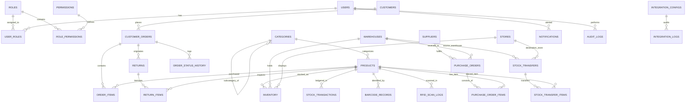

# ENTITY RELATIONSHIP (ER) DIAGRAM
## Retail Inventory Management System (RIMS)
**Project Code:** `PRG_RIMS_001`  

---

```mermaid
erDiagram
    ROLES ||--o{ USER_ROLES : assigned_to
    USERS ||--o{ USER_ROLES : has
    ROLES ||--o{ ROLE_PERMISSIONS : contains
    PERMISSIONS ||--o{ ROLE_PERMISSIONS : defines

    CATEGORIES ||--o{ CATEGORIES : subcategory_of
    CATEGORIES ||--o{ PRODUCTS : categorizes
    PRODUCTS ||--o{ INVENTORY : stocked_as
    WAREHOUSES ||--o{ INVENTORY : holds
    STORES ||--o{ INVENTORY : displays

    PRODUCTS ||--o{ STOCK_TRANSACTIONS : ledgered_in
    PRODUCTS ||--o{ BARCODE_RECORDS : identified_by
    PRODUCTS ||--o{ RFID_SCAN_LOGS : scanned_in

    SUPPLIERS ||--o{ PURCHASE_ORDERS : fulfills
    WAREHOUSES ||--o{ PURCHASE_ORDERS : receives_to
    PURCHASE_ORDERS ||--o{ PURCHASE_ORDER_ITEMS : consists_of
    PRODUCTS ||--o{ PURCHASE_ORDER_ITEMS : line_item

    CUSTOMERS ||--o{ CUSTOMER_ORDERS : places
    CUSTOMER_ORDERS ||--o{ ORDER_ITEMS : contains
    PRODUCTS ||--o{ ORDER_ITEMS : purchased
    CUSTOMER_ORDERS ||--o{ ORDER_STATUS_HISTORY : logs
    CUSTOMER_ORDERS ||--o{ RETURNS : originates
    RETURNS ||--o{ RETURN_ITEMS : itemizes
    PRODUCTS ||--o{ RETURN_ITEMS : inspects

    WAREHOUSES ||--o{ STOCK_TRANSFERS : source_warehouse
    STORES ||--o{ STOCK_TRANSFERS : destination_store
    STOCK_TRANSFERS ||--o{ STOCK_TRANSFER_ITEMS : transfers
    PRODUCTS ||--o{ STOCK_TRANSFER_ITEMS : moved_item

    USERS ||--o{ NOTIFICATIONS : alerted
    USERS ||--o{ AUDIT_LOGS : performs
    INTEGRATION_CONFIGS ||--o{ INTEGRATION_LOGS : audits
```
